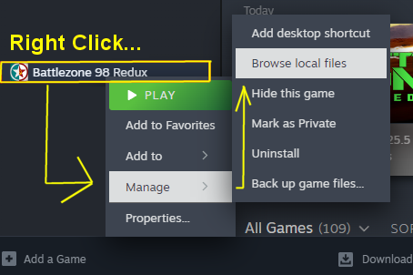
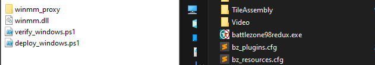

# Battlezone Netcode Patch - Tester Guide

This repo helps test larger multiplayer socket buffers for Battlezone 98 Redux.

Target values:

- Send buffer: 524288
- Receive buffer: 2097152

> **These instructions assume you downloaded this repo as a ZIP from GitHub and extracted it to your Downloads folder.**
> All commands below are fully copy-pasteable — `$USER` and `$HOME` expand automatically to your username and home folder.

---

## Windows

### Step 1: Copy the DLL

1. Open Steam
2. Right-click **Battlezone 98 Redux** in your library
3. Click **Manage → Browse local files**
4. A folder opens — this is your game folder
5. Copy `Microslop\winmm.dll` from this repo into that game folder






### Step 2: Play

1. Launch **Battlezone 98 Redux** from Steam
2. Go to **Multiplayer**
3. Exit the game

### Step 3: Verify

Open PowerShell in the repo folder and run:

```powershell
.\Microslop\verify_windows.ps1
```

**Success = `RESULT: PASS`**

## After Each Stress Test (Send This Back)

After every test run, collect a bundle and send the generated archive file back to the test coordinator.

Windows:

```powershell
.\Microslop\collect_windows_test_bundle.ps1
```

Bundle output location:

- Windows: `test_bundles/*.zip`

## Deep Diagnostics (Lag + Crash Investigation)

Use this only for bad sessions (heavy lag, desync, crash, freeze). It captures deeper network/system data.

Windows:

```powershell
.\Microslop\start_deep_diag.ps1
```

Run your match, then stop and bundle:

```powershell
.\Microslop\stop_deep_diag.ps1
```

Linux Native Steam:

```bash
cd ~/Downloads/battlezone-netcode-patch-master
./Linux/start_deep_diag.sh "/home/$USER/.local/share/Steam/steamapps/common/Battlezone 98 Redux"
```

Run your match, then stop and bundle:

```bash
cd ~/Downloads/battlezone-netcode-patch-master
./Linux/stop_deep_diag.sh
```

Linux Snap Steam:

```bash
cd ~/Downloads/battlezone-netcode-patch-master
./Linux/start_deep_diag.sh "/home/$USER/snap/steam/common/.local/share/Steam/steamapps/common/Battlezone 98 Redux"
```

Linux Flatpak Steam:

```bash
cd ~/Downloads/battlezone-netcode-patch-master
./Linux/start_deep_diag.sh "/home/$USER/.var/app/com.valvesoftware.Steam/data/Steam/steamapps/common/Battlezone 98 Redux"
```

Notes:

- Windows `netsh` capture works best in an elevated PowerShell.
- Windows crash dumps are collected automatically if `procdump.exe` is installed.
- Linux Proton logs are captured if Steam launch options include `PROTON_LOG=1 %command%`.
- Deep diagnostics bundles are written under `test_bundles/deep_*`.

---

## Linux - Native Steam

Use this if you installed Steam natively, IF you installed via Snap or Flatpak, scroll down.

### Step 1: Install required tools

Open a terminal and run the command for your distro:

**Debian:**
```bash
sudo apt install mingw-w64 make
```

**Arch:**
```bash
sudo pacman -S mingw-w64-gcc make
```

### Step 2: Deploy the patch

```bash
cd ~/Downloads/battlezone-netcode-patch-master
./Linux/deploy_linux.sh "/home/$USER/.local/share/Steam/steamapps/common/Battlezone 98 Redux"
```

### Step 3: Set Steam launch options

1. Open Steam
2. Right-click **Battlezone 98 Redux** in your library
3. Click **Properties**
4. Click **General** on the left
5. Find the **Launch Options** box at the bottom
6. Paste this into it:

```
WINEDLLOVERRIDES="dsound=n,b" %command% -nointro
```

7. Close the window

### Step 4: Play

1. Launch **Battlezone 98 Redux** from Steam
2. Go to **Multiplayer**
3. Exit the game

### Step 5: Verify

```bash
cd "/home/$USER/.local/share/Steam/steamapps/common/Battlezone 98 Redux"
VERIFY_PROXY_READBACK=1 ~/Downloads/battlezone-netcode-patch-master/Linux/verify_net_patch.sh
```

**Success = `VERIFY RESULT: PASS`**

## After Each Stress Test (Send This Back)

After every test run, collect a bundle and send the generated archive file back to the test coordinator.

Linux Native Steam:

```bash
cd ~/Downloads/battlezone-netcode-patch-master
./Linux/collect_test_bundle.sh "/home/$USER/.local/share/Steam/steamapps/common/Battlezone 98 Redux"
```
Bundle output location:

- Linux: `test_bundles/*.tar.gz`

---

## Linux - Snap Steam

Use this if you installed Steam via Snap (`snap install steam`).

### Step 1: Install required tools

Open a terminal and run the command for your distro:

**Debian:**
```bash
sudo apt install mingw-w64 make
```

**Arch:**
```bash
sudo pacman -S mingw-w64-gcc make
```

### Step 2: Deploy the patch

```bash
cd ~/Downloads/battlezone-netcode-patch-master
./Linux/deploy_linux.sh "/home/$USER/snap/steam/common/.local/share/Steam/steamapps/common/Battlezone 98 Redux"
```

> If this fails with "Missing game executable", your Snap Steam path is different.
> Open Steam → right-click Battlezone 98 Redux → **Manage → Browse local files**,
> then open a terminal in that folder and run `pwd` to get the exact path.
> Replace the path above with that.

### Step 3: Set Steam launch options

1. Open Steam
2. Right-click **Battlezone 98 Redux** in your library
3. Click **Properties**
4. Click **General** on the left
5. Find the **Launch Options** box at the bottom
6. Paste this into it:

```
WINEDLLOVERRIDES="dsound=n,b" %command% -nointro
```

7. Close the window

### Step 4: Play

1. Launch **Battlezone 98 Redux** from Steam
2. Go to **Multiplayer**
3. Exit the game

### Step 5: Verify

```bash
cd "/home/$USER/snap/steam/common/.local/share/Steam/steamapps/common/Battlezone 98 Redux"
VERIFY_PROXY_READBACK=1 ~/Downloads/battlezone-netcode-patch-master/Linux/verify_net_patch.sh
```

**Success = `VERIFY RESULT: PASS`**

## After Each Stress Test (Send This Back)

After every test run, collect a bundle and send the generated archive file back to the test coordinator.

Linux Snap Steam:

```bash
cd ~/Downloads/battlezone-netcode-patch-master
./Linux/collect_test_bundle.sh "/home/$USER/snap/steam/common/.local/share/Steam/steamapps/common/Battlezone 98 Redux"
```
Bundle output location:

- Linux: `test_bundles/*.tar.gz`

---

## Linux - Flatpak Steam

Use this if you installed Steam via Flatpak (`flatpak install steam`).

### Step 1: Install required tools

Open a terminal and run the command for your distro:

**Debian:**
```bash
sudo apt install mingw-w64 make
```

**Arch:**
```bash
sudo pacman -S mingw-w64-gcc make
```

### Step 2: Deploy the patch

```bash
cd ~/Downloads/battlezone-netcode-patch-master
./Linux/deploy_linux.sh "/home/$USER/.var/app/com.valvesoftware.Steam/data/Steam/steamapps/common/Battlezone 98 Redux"
```

> If this fails with "Missing game executable", your Flatpak Steam path is different.
> Open Steam → right-click Battlezone 98 Redux → **Manage → Browse local files**,
> then open a terminal in that folder and run `pwd` to get the exact path.
> Replace the path above with that.

### Step 3: Set Steam launch options

1. Open Steam
2. Right-click **Battlezone 98 Redux** in your library
3. Click **Properties**
4. Click **General** on the left
5. Find the **Launch Options** box at the bottom
6. Paste this into it:

```
WINEDLLOVERRIDES="dsound=n,b" %command% -nointro
```

7. Close the window

### Step 4: Play

1. Launch **Battlezone 98 Redux** from Steam
2. Go to **Multiplayer**
3. Exit the game

### Step 5: Verify

```bash
cd "/home/$USER/.var/app/com.valvesoftware.Steam/data/Steam/steamapps/common/Battlezone 98 Redux"
VERIFY_PROXY_READBACK=1 ~/Downloads/battlezone-netcode-patch-master/Linux/verify_net_patch.sh
```

**Success = `VERIFY RESULT: PASS`**


## After Each Stress Test (Send This Back)

After every test run, collect a bundle and send the generated archive file back to the test coordinator.

Linux Flatpak Steam:

```bash
cd ~/Downloads/battlezone-netcode-patch-master
./Linux/collect_test_bundle.sh "/home/$USER/.var/app/com.valvesoftware.Steam/data/Steam/steamapps/common/Battlezone 98 Redux"
```
Bundle output location:

- Linux: `test_bundles/*.tar.gz`

---


## Important Note

The Battlezone startup text line can still show old values even when the patch is working.
Use proxy log readback (`dsound_proxy.log` or `winmm_proxy.log`) as source of truth.

## Technical Details

- Full investigation history: `INVESTIGATION_WRITEUP.md`
